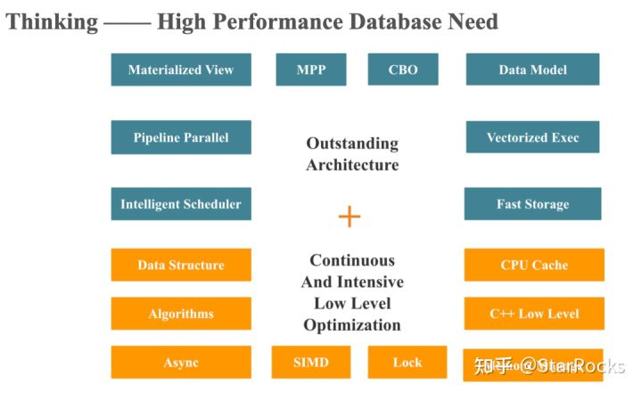

## 学什么？

看了一位starrocks的数据库工程师的[博客](https://blog.bcmeng.com/)之后，发现数据库竟然牵涉到如此多底层设计与实现的性能优化。

如下图所示，从内存管理优化、CPU 性能利用（如CPU cache和SIMD优化）到上层的 C++ Low Level 优化、数据结构和算法、高性能第三方库，每部分都有极大的性能榨取空间

#### 学习资料

[starrocks康凯森学习资料](https://blog.bcmeng.com/post/database-learning.html)

[pingcap](https://github.com/pingcap/awesome-database-learning)

#### 接下来的学习计划

- [ ] 高性能计算
- [ ] 由OLAP型数据库需求伴随而来的列存
- [ ] 数据库的编译执行
- [ ] 数据库的查询优化

